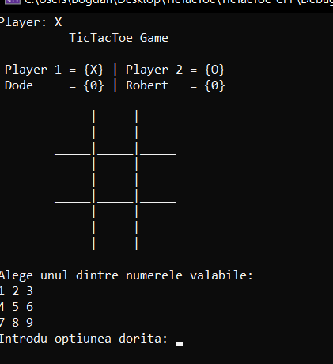
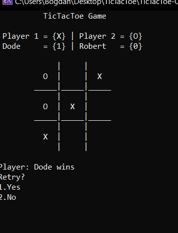

# TicTacToe - C++ Game

The first project made from 0 in c ++.

The game can only be played in 2 players. The current implementation does not have the fight against AI.

The implementaton is in Romanian laguage.

Down you have a demo about how the game looks.

In the first place you choose the name of players (Player1 and Player 2).

You can play by choosing a number *1-9*.

This is how it looks when you play.

This is how it looks when someone wins.

There is an implementation for change sides.

